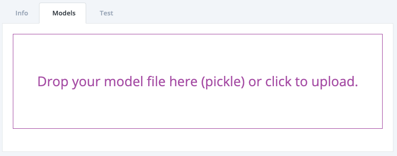
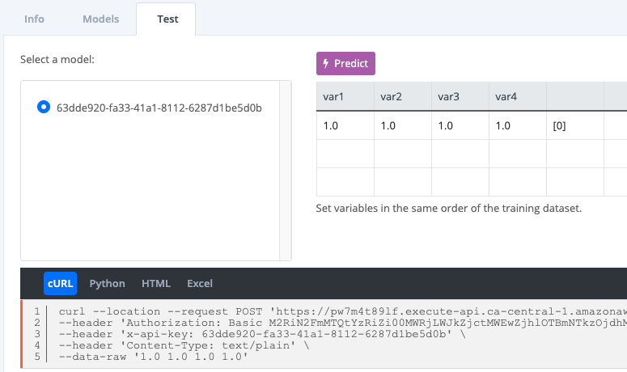
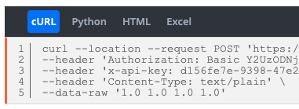
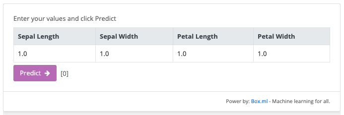
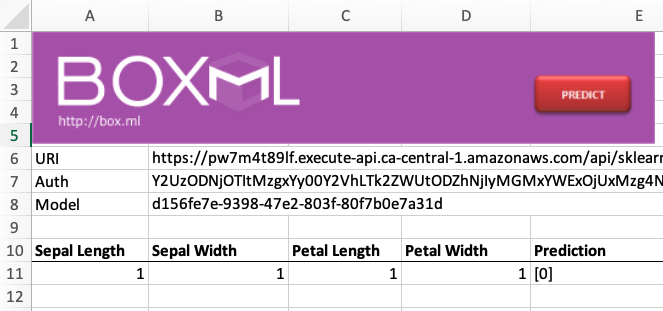

# Logistic Regression models in Box.ml
Box.ml is the easiest and fastest way to put machine learning models in the hands of your users. With a simple drag and drop your model is just ready to use. Then, you can call your model safely from anywhere, including Excel, blogs and apps. 

Here, your are going to train a [Logistic Regression](https://en.wikipedia.org/wiki/Logistic_regression) model using the classic [Iris Dataset](https://en.wikipedia.org/wiki/Iris_flower_data_set). Then, you will be able to safely call it in a matter of seconds by just droping it in Box.ml.

To train the Machine learning model you will use the popular [scikit-learn](https://scikit-learn.org/stable/modules/generated/sklearn.linear_model.LogisticRegression.html)

# Setup
Please, feel free to skip the steps that you don't need.
```
brew install python3
pip3 install virtualenv
```

Create a local copy of this git repository in your computer:
```
git clone https://github.com/box-ml/iris-classification-logistic-regression.git
cd iris-classification-logistic-regression
```

Create a virtual environment and activate it:
```
virtualenv -p python3 venv
source venv/bin/activate
```

Install scikit-learn and other necessary packages:
```
pip install -r requirements.txt
```

# Train
To train the Machine Learning model just execute the following line:
```
python train.py
```

The trained model will be exported to the file:  
*iris_logistic_regression.pkl*

# Box.ml
Login into [box.ml](https://box.ml/login), select or create a new Deployment, then drag & drop the file *iris_logistic_regression.pkl* in the box:  



Your model will be ready to use in a second. You can click the Predict button and the result of the prediction will be shown next to the latest variable value:



Change variables names and input examples and confirm that the predictions are the expected ones.

Now, copy the code snippet from the *cURL* or *Python* tab and test it from your terminal:



You should see the predictions coming from your model that is now live in box.ml.

You can use the code in the HTML tab to show a prediction box in your website or blog:



Your readers will be able to enter the values and make predictions by themselves.

Lastly, from the Excel tab you can download an Excel file ready to use:

