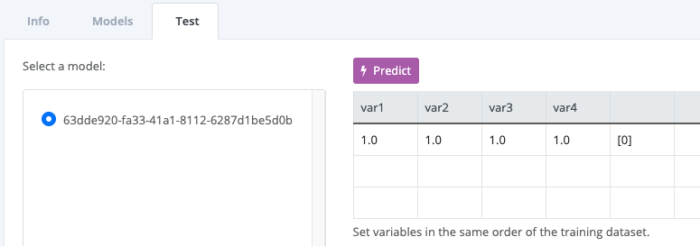
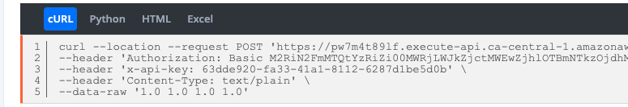

# Logistic Regression models in Box.ml
[Box.ml](https://box.ml/login) is the easiest and fastest way to put machine learning models in the hands of your users. It takes a simple drag and drop and your model is ready-to-use; In a matter of seconds you can call your model from anywhere including Excel, blogs and apps.

In this short tutorial, your are going to train a [Logistic Regression](https://en.wikipedia.org/wiki/Logistic_regression) model using the classic [Iris Dataset](https://en.wikipedia.org/wiki/Iris_flower_data_set). After dropping it in box.ml, the tutorial walks you through the simple steps to start using it.

You will use the popular [scikit-learn](https://scikit-learn.org/stable/modules/generated/sklearn.linear_model.LogisticRegression.html) libray to train the Machine learning model that you will need to complete this tutorial.

# Setup
Please, feel free to skip the steps that you don't need.
```
brew install python3
pip3 install virtualenv
```

Create a local copy of this git repository in your computer:
```
git clone https://github.com/box-ml/iris-classification-logistic-regression.git
cd iris-classification-logistic-regression
```

Create a virtual environment and activate it:
```
virtualenv -p python3 venv
source venv/bin/activate
```

Install scikit-learn and other necessary packages:
```
pip install -r requirements.txt
```

# Train
To train the Machine Learning model just execute the following line:
```
python train.py
```

The trained model will be exported to the file: *iris_logistic_regression.pkl*

# Box.ml
In order to make your model available from anywhere: 1) login into [box.ml](https://box.ml/login), 2) select or create a new Deployment, 3) drag and drop the file *iris_logistic_regression.pkl* in the box, similar to the image below. Your model will be ready-to-use in a second.


You can click the Predict button and the result of the prediction will be shown next to the last variable value:



Set the right variable names and test with a few of input examples to confirm that the predictions are correct.

The code snippet provided in the *cURL* and *Python* tabs is ready-to-use. You can copy and test it from your terminal. You should see the predictions coming from your model that is now live in [box.ml](https://box.ml/login).



You can use the code in the HTML tab to show a prediction box in your website or blog like shown in the image below. Your readers will be able to enter the values and make predictions by themselves.


Lastly, from the Excel tab, you can download an Excel file ready-to-use:


# How it works
Every time you drop a trained model in [box.ml](https://box.ml/login) you receive:  
- A Unique Identifier for your model
- A Client Id and a Client Secret

With these three things you can call your model from anywhere. 

# Security
Technically speaking, your model is made available via a [REST API](https://en.wikipedia.org/wiki/Representational_state_transfer), a very standard and secure practice.

The combination of the model's Unique Identifier, the Client Id and the Client Secret provide enough security to keep the use of your models safe of intruders.

You will have to share the model's Unique Identifier among your users but as a safe practice, create a different Client Id and Client Secret for eachone.
